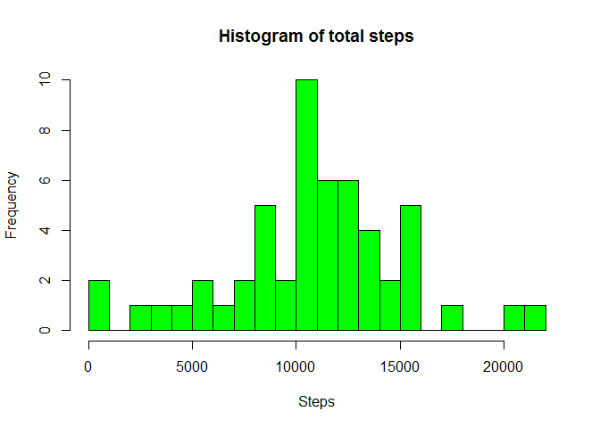
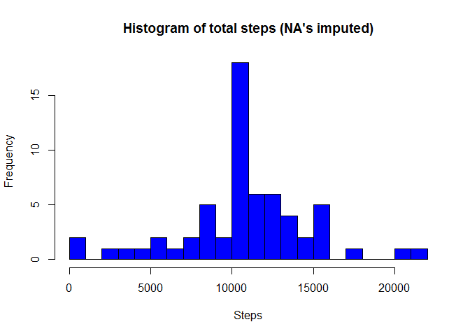

## Loading and preprocessing the data

```r
library(dplyr)

# set locale
Sys.setlocale("LC_TIME", "C")
```

```
## [1] "C"
```

```r
# read data from zipfile
data <- read.csv(unz("activity.zip","activity.csv"))

# convert dates
data$date <- as.Date(data$date, format="%Y-%m-%d")

# pretty up column names
names(data) <- c("Steps","Date","Interval")

# remove NA's in steps
data_nona <- data %>% filter(!is.na(data$Steps))
```


## What is mean total number of steps taken per day?

```r
# group by date and summarise steps
steps_total <- data_nona %>% group_by(Date) %>% summarise(Sum=sum(Steps, na.rm=TRUE))
hist(steps_total$Sum, breaks=25, col="green", main="Histogram of total steps",xlab="Steps")
```

<!-- -->

```r
mean_steps=mean(steps_total$Sum)
median_steps=median(steps_total$Sum)
```

Mean steps a day: 10766.19  

Median steps a day: 10765


## What is the average daily activity pattern?

```r
# group by interval an average steps
steps_int <- data_nona %>% group_by(Interval) %>% summarise(Avg=mean(Steps, na.rm=TRUE))
names(steps_int) <- c("Interval","Avg")

plot(steps_int, type="l", ylab="Avg. steps")
```

<!-- -->

```r
# get interval with maximal average steps
max_int <- steps_int[order(steps_int$Avg, decreasing = TRUE)[1],]
```

Interval with the max number of steps is **835** with **206.1698** steps.


## Imputing missing values

```r
# get number of NA values in dataset
cnt_na <- count(data %>% filter(is.na(data$Steps)))
```

Total number of rows with NA: **2304**


```r
# function for calculating average steps per interval
get_avg_steps <- function(interval){
  data_int <- data %>% filter(Interval==interval)
  mean(data_int$Steps,na.rm=TRUE)
}

# create new dataset with imputet NA values
data_imp <- data
for( i in 0:471)
{
  imp_steps = get_avg_steps(i*5)
  data_imp[data$Interval==i*5&is.na(data_imp$Steps),1] <- imp_steps
}

# group by date and summarise steps
steps_total_imp <- data_imp %>% group_by(Date) %>% summarise(Sum=sum(Steps))
hist(steps_total_imp$Sum, breaks=25, col="blue", main="Histogram of total steps (NA's imputed)", xlab="Steps")
```

<!-- -->

```r
mean_steps_imp=mean(steps_total_imp$Sum)
median_steps_imp=median(steps_total_imp$Sum)
```

Mean steps a day: 10766.19  

Median steps a day: 10766.19

The mean and median values are now equal and the peak in the histogram is more pronounced.


## Are there differences in activity patterns between weekdays and weekends?

```r
# create column with weekday
data_imp$Weekday<-weekdays(data_imp$Date)

# function for detecting weekend
is_weekend <- function( wday ){
  if( wday=="Saturday" | wday=="Sunday")
  {
    "weekend"
  }
  else
  {
    "weekday"
  }
}

# create new column indicating weekend
data_imp$Weekend <- sapply(data_imp$Weekday,is_weekend)

# group by interval an average steps
steps_int_weekend <- data_imp %>% group_by(Interval,Weekend) %>% summarise(Avg=mean(Steps))

library(lattice)
xyplot(Avg ~ Interval| Weekend, steps_int_weekend, layout=c(1,2), type="l", 
       ylab="Number of steps")
```

<!-- -->
